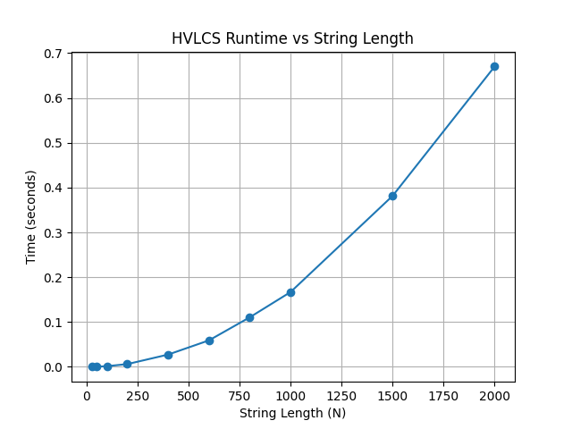

# COP4533_Programming_Assignment3

---

## Team Members
* Justin Oh (78478358)
* Adam Lim (23149660)

---

## Instructions
**To run the solver:**
No compilation required. Uses Python 3.
`python src/hvlcs.py <input_file>`

**Example:**
`python src/hvlcs.py data/example.in`

**To run the benchmark:**
`python src/benchmark.py` (Requires `matplotlib` for graphing).

**Assumptions:**
* Strings A and B only contain characters defined in the alphabet list.
* Values are nonnegative integers.

---

## Written Component

### Question 1: Empirical Comparison

*(Run `src/benchmark.py` to generate the graph of the 10 files).*
As seen in the graph, the runtime curve exhibits quadratic growth. As the string lengths double, the execution time roughly quadruples.

### Question 2: Recurrence Equation
Let OPT(i, j) be the maximum value of a common subsequence using the prefix A[1..i] and B[1..j].

Let v(c) be the value assigned to character c.

**Base Cases:**

OPT(i, 0) = 0 for all i

OPT(0, j) = 0 for all j

**Recurrence:**

If A[i] == B[j]:

* OPT(i, j) = OPT(i-1, j-1) + v(A[i])

If A[i] ≠ B[j]:

* OPT(i, j) = max(OPT(i-1, j), OPT(i, j-1))

**Explanation:**
If the current characters match, the optimal solution must include this character. We add its value to the optimal solution of the remaining prefixes. If they do not match, we cannot include both. We must either drop A[i] or drop B[j]. We take the maximum of these two possibilities.

### Question 3: Big-Oh
**Pseudocode:**
```text
function HVLCS(A, B, values):
    m = length(A)
    n = length(B)
    Initialize dp[m+1][n+1] to 0

    for i from 1 to m:
        for j from 1 to n:
            if A[i-1] == B[j-1]:
                dp[i][j] = dp[i-1][j-1] + values[A[i-1]]
            else:
                dp[i][j] = max(dp[i-1][j], dp[i][j-1])
                
    return dp[m][n]
```

**Runtime Analysis:**

The algorithm uses a nested loop. The outer loop runs `m` times (length of A)
and the inner loop runs `n` times (length of B). All operations inside the
loop are O(1). Therefore the total runtime is **O(m ⋅ n)**. Space complexity
is also **O(m ⋅ n)** to store the DP table.